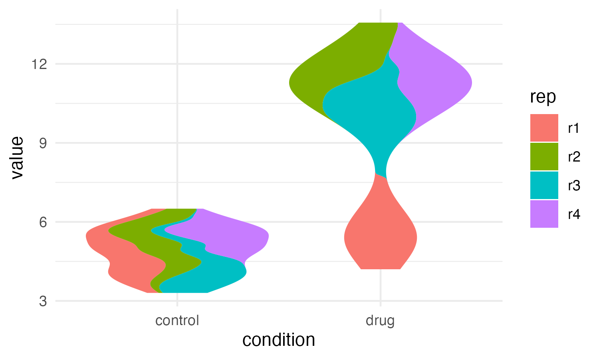
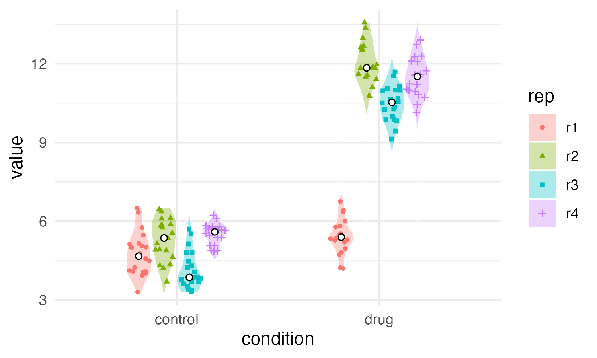

ggsuperviolin: violin superplots for ggplot2
====

## Introduction
Inspired by the [SuperPlots](https://rupress.org/jcb/article/219/6/e202001064/151717/SuperPlots-Communicating-reproducibility-and) and [Violin SuperPlots](https://www.molbiolcell.org/doi/10.1091/mbc.E21-03-0130) editorials, I wanted a way to create violin superplots in R. See also the [original Violin SuperPlots package for python](https://github.com/kynnemall/superviolin?tab=readme-ov-file).

## Installation

``` r
devtools::install_github("andrewrlynch/ggsuperviolin")
```

## Examples
```{r}
df <- data.frame(
  condition = rep(c("control", "drug"), each = 4 * 20),
  rep       = rep(paste0("r", 1:4), times = 2, each = 20),
  value     = c(
    rnorm(20, 5, 0.7),
    rnorm(20, 5.5, 0.7),
    rnorm(20, 4.5, 0.7),
    rnorm(20, 5.5, 0.7),
    rnorm(20, 5.5, 0.7),
    rnorm(20, 12, 0.7),
    rnorm(20, 10.5, 0.7),
    rnorm(20, 11.5, 0.7)
  )
)


ggplot(df, aes(x = condition, y = value, fill = rep)) +
  geom_superviolin(aes(rep = rep)) +
  theme_minimal()

```



### If you want to plot the centrality of each replicate.

```{r}
ggplot(df, aes(x = condition, y = value, fill = rep)) +
  geom_superviolin(aes(rep = rep), color = "black") +
  stat_supercentral(aes(rep = rep), fun = "median", shape = 21, fill = "white") +
  geom_violin(aes(group = condition), fill = NA, scale = "width", draw_quantiles = 0.5) +
  theme_minimal()
```


### If you want to place jittered data points within replicates' distributions.

```{r}
ggplot(df, aes(x = condition, y = value)) +
  geom_superviolin(aes(rep = rep, fill = rep), color = "white", alpha = 0.33) +
  stat_superpoint(aes(rep = rep, color = rep, shape = rep), size = 1) +
  stat_supercentral(aes(rep = rep), shape = 21, fill = "white") +
  theme_minimal()
```


### If for some reason you wanted to use this package to split out your replicates.
```{r}
ggplot(df, aes(x = condition, y = value, fill = rep)) +
  geom_superviolin(aes(rep = rep), color = "white", preserve = 'rep', alpha = 0.33, width = 0.5) +
  stat_superpoint(aes(rep = rep, color = rep, shape = rep), preserve = 'rep', size = 1, width = 0.5) +
  stat_supercentral(aes(rep = rep), shape = 21, fill = "white", preserve = 'rep', width = 0.5) +
  theme_minimal()
```


